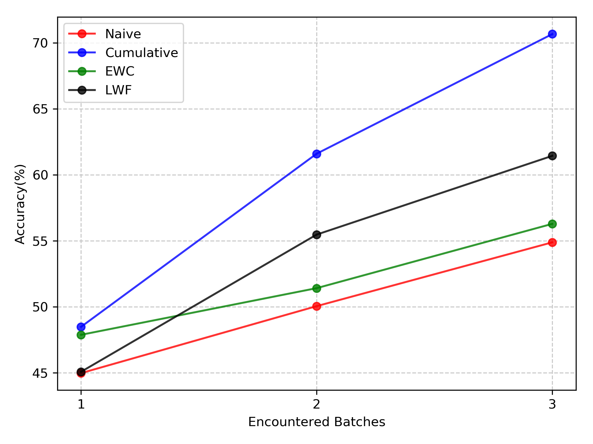
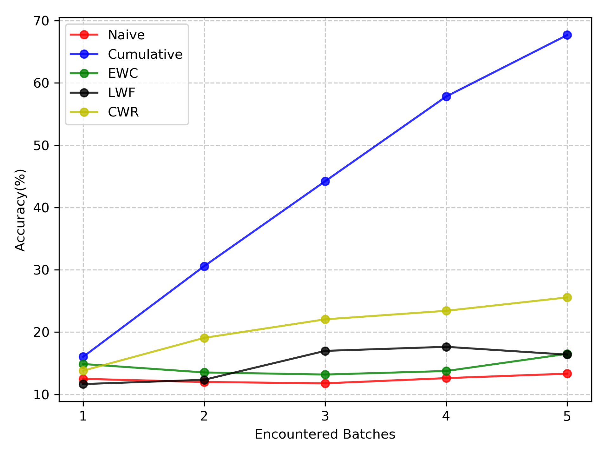
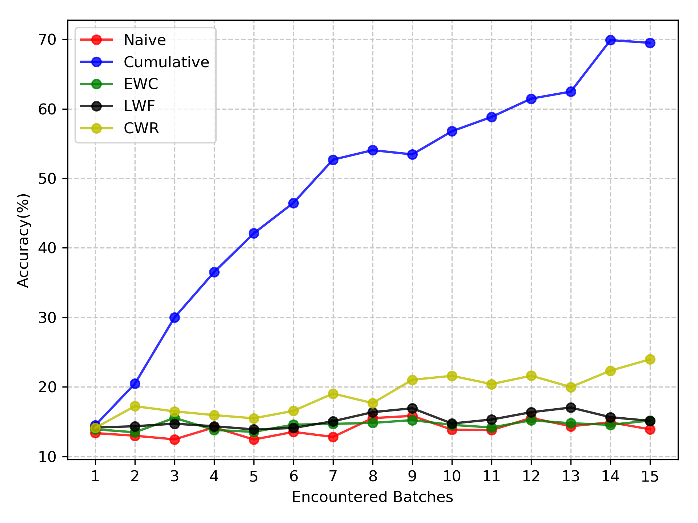

# CLRS: Continual Learning Benchmark for Remote Sensing Image Scene Classification

Remote sensing image scene classification has a high application value in the agricultural, military, as well as other fields. A large amount of remote sensing data is obtained every day. After learning the new batch data, scene classification algorithms based on deep learning face the problem of catastrophic forgetting, that is, they cannot maintain the performance of the old batch data. Therefore, it has become more and more important to ensure that the scene classification model has the ability of continual learning, that is, to learn new batch data without forgetting the performance of the old batch data. However, the existing remote sensing image scene classification datasets all use static benchmarks and lack the standard to divide the datasets into a number of sequential learning training batches, which largely limits the development of continual learning in remote sensing image scene classification. First, this study gives the criteria for training batches that have been partitioned into three continual learning scenarios, and proposes a large-scale remote sensing image scene classification database called the Continual Learning Benchmark for Remote Sensing (CLRS). The goal of CLRS is to help develop state-of-the-art continual learning algorithms in the field of remote sensing image scene classification. In addition, in this paper, a new method of constructing a large-scale remote sensing image classification database based on the target detection pretrained model is proposed, which can effectively reduce manual annotations. Finally, several mainstream continual learning methods are tested and analyzed under three continual learning scenarios, and the results can be used as a baseline for future work.

The manuscript can be visited at https://www.mdpi.com/1424-8220/20/4/1226

If this repo is useful in your research, please kindly consider citing our paper as follow.
```
Bibtex
@Article{s20041226,
AUTHOR = {Li, Haifeng and Jiang, Hao and Gu, Xin and Peng, Jian and Li, Wenbo and Hong, Liang and Tao, Chao},
TITLE = {CLRS: Continual Learning Benchmark for Remote Sensing Image Scene Classification},
JOURNAL = {Sensors},
VOLUME = {20},
YEAR = {2020},
NUMBER = {4},
ARTICLE-NUMBER = {1226},
URL = {https://www.mdpi.com/1424-8220/20/4/1226},
ISSN = {1424-8220},
ABSTRACT = {Remote sensing image scene classification has a high application value in the agricultural, military, as well as other fields. A large amount of remote sensing data is obtained every day. After learning the new batch data, scene classification algorithms based on deep learning face the problem of catastrophic forgetting, that is, they cannot maintain the performance of the old batch data. Therefore, it has become more and more important to ensure that the scene classification model has the ability of continual learning, that is, to learn new batch data without forgetting the performance of the old batch data. However, the existing remote sensing image scene classification datasets all use static benchmarks and lack the standard to divide the datasets into a number of sequential learning training batches, which largely limits the development of continual learning in remote sensing image scene classification. First, this study gives the criteria for training batches that have been partitioned into three continual learning scenarios, and proposes a large-scale remote sensing image scene classification database called the Continual Learning Benchmark for Remote Sensing (CLRS). The goal of CLRS is to help develop state-of-the-art continual learning algorithms in the field of remote sensing image scene classification. In addition, in this paper, a new method of constructing a large-scale remote sensing image classification database based on the target detection pretrained model is proposed, which can effectively reduce manual annotations. Finally, several mainstream continual learning methods are tested and analyzed under three continual learning scenarios, and the results can be used as a baseline for future work.},
DOI = {10.3390/s20041226}
}
```


# CLRS Dataset
The proposed CLRS data set consists of 15,000 remote sensing images divided into 25 scene classes, namely, airport, bare-land, beach, bridge, commercial, desert, farmland, forest, golf-course, highway, industrial, meadow, mountain, overpass, park, parking, playground, port, railway, railway-station, residential, river, runway, stadium, and storage-tank. Each class has 600 images, and the image size is 256x256. The resolution of the images ranges from 0.26 m to 8.85 m. <br> 
<div align=center></div>

# Experiment results
NI scenario:<br>


NC scenario:<br>


NIC scenario:<br>


# CLRS Dataset download
[CLRS Dataset can be downloaded here in BaiduYun](https://pan.baidu.com/s/1NkkaJxPtewW5fQMk8yCAQw)


